# 详解属性动画中的插值器/估值器
在写动效时，我们经常会用到插值器和估值器。那么我们今天主要来说一下以下几个点。
1.  插值器和估值器是什么 
2.  插值器和估值器的应用场景，他们之前有什么关系
3.  如何自定义
4. 工作原理
 
## 1.插值器
```java
public interface TimeInterpolator {
    float getInterpolation(float input);
}
```
input : Input是一个[0-1]之间的数，表示动画“整体”的进度，永远是线性变化。0表示开始，1表示结束

### 定义：
接口类型
###  作用：
定义动画变化的速率，允许动画具有非线性运动，例 如加速和减速。

`Interpolator`是一个补间动画的接口，从`api 1`就有，主要给补间动画类`alpha`, `scale`, `translate`, `rotate`使用。那么到了3.0引入属性动画后，Android新扩展了`TimeInterpolator`这个接口，将原来的方法
```
float getInterpolation(float input);
```
移动到`TimeInterpolator`。`Interpolator`继承了`TimeInterpolator`，这使得过去所有实现`Interpolator`接口的实现类，都可以给属性动画使用

###使用场景：
实现非线性变化的动画时，如加减速
###使用方式：
插值器在动画的使用有两种方式：在XML / Java代码中设置：
* 在动画效果的XML代码中设置插值器属性`android:interpolator`

     
```xml
<?xml version="1.0" encoding="utf-8"?>
<scale xmlns:android="http://schemas.android.com/apk/res/android"
android:interpolator="@android:anim/overshoot_interpolator"
    // 通过资源ID设置插值器
    android:duration="3000"
    android:fromXScale="0.0"
    android:fromYScale="0.0"
    android:pivotX="50%"
    android:pivotY="50%"
    android:toXScale="2"
    android:toYScale="2" />
```
        
* 在 Java 代码中设置

```
// 步骤1:创建 需要设置动画的 视图View
Button mButton = (Button)findViewById(R.id.Button);
// 步骤2：创建透明度动画的对象 & 设置动画效果
Animation alphaAnimation = new AlphaAnimation(1,0);
alphaAnimation.setDuration(3000);
// 步骤3：创建对应的插值器类对象
Interpolator overshootInterpolator = new OvershootInterpolator();
// 步骤4：给动画设置插值器
alphaAnimation.setInterpolator(overshootInterpolator);
// 步骤5：播放动画
mButton.startAnimation(alphaAnimation);

```
 
### Android中内置的10个系统插值器
| 作用                 | 资源ID                                              | 对应的Java类                         |
|--------------------|---------------------------------------------------|----------------------------------|
| 动画加速进行             | @android:anim/accelerate_interpolator             | AccelerateInterpolator           |
| 快速完成动画，超出再回到结束样式   | @android:anim/overshoot_interpolator              | OvershootInterpolator            |
| 先加速再减速             | @android:anim/accelerate_ decelerate_interpolator | AccelerateDecelerateInterpolator |
| 先退后再加速前进           | @android:anim/anticipate_interpolator             | AnticipateInterpolator           |
| 先退后再加速前进，超出终点后再回终点 | @android:anim/anticipate_ overshoot_interpolator  | AnticipateOvershootInterpolator  |
| 最后阶段弹球效果           | @android:anim/bounce_interpolator                 | BounceInterpolator               |
| 周期运动               | @android:anim/cycle_interpolator                  | CycleInterpolator                |
| 减速                 | @android:anim/decelerate_interpolator             | DecelerateInterpolator           |
| 匀速                 | @android:anim/linear_interpolator                 | LinearInterpolator               |
| 路径动画               | 无                                                 | PathInterpolator                 |

###系统自带插值器的效果图
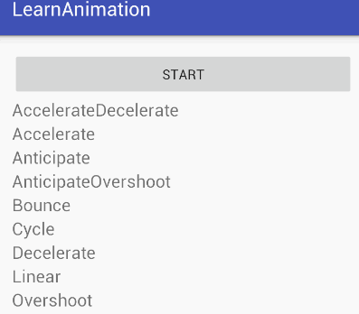

> 基本上这十种动画插值器能满足我们日常开发中的大部分需求。遇到设计给的特殊线性效果时，我们才会用到自定义插值器。

#2.插值曲线
说到曲线，就要了解一下各种插值器的实现算法，不过不用担心看不懂，大部分算法是高中数学知识，我们使用一些画图软件将曲线展示出来，就能明白其工作原理。各种插值器的实现算法，都放在getInterpolation这个方法中

|  插值器名称 |  曲线算法 | 函数(0≤x≤1)  | 曲线图  |
|---|---|---|---|
|  LinearInterpolator |略|  y=x | 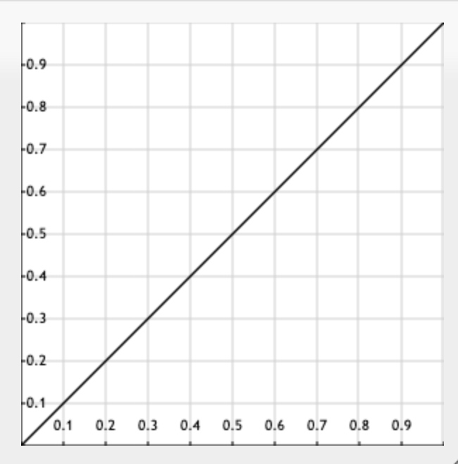
 |
|  加速插值器AccelerateInterpolator |   |  y = x^2f | 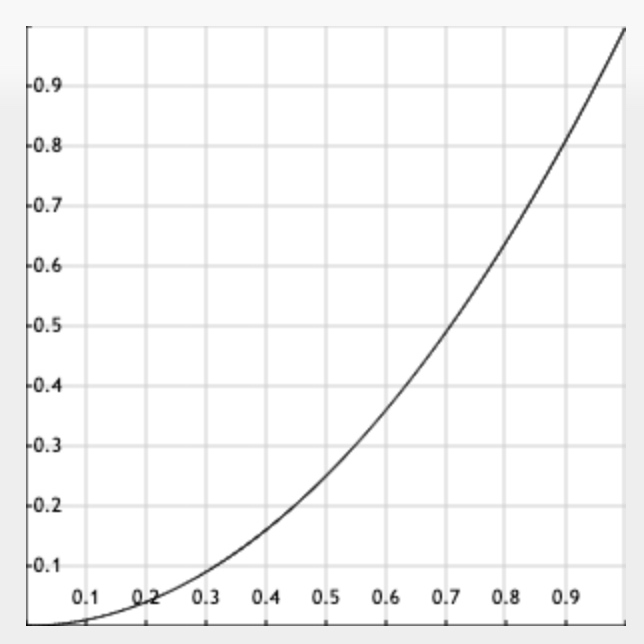
  |
|  减速插值器 |   | y = 1-(1-x)^2f|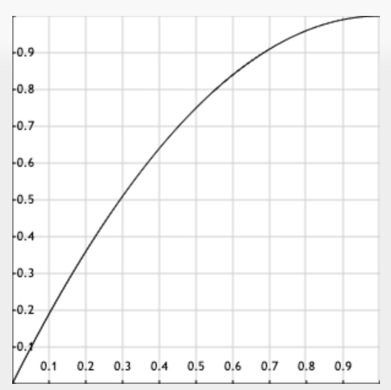
|
|  加速减速插值器 |   |  y = 0.5*cos(π*(x + 1)) + 0.5 |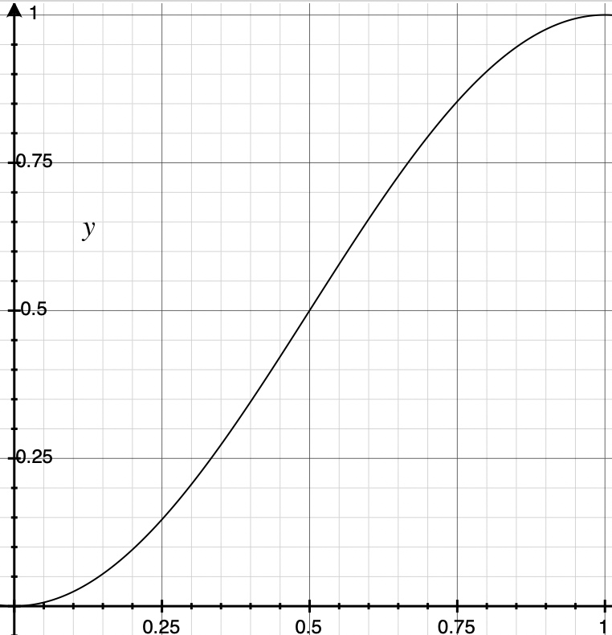
   |
|  OvershootInterpolator |   |  y = (x - 1)^2((T+1)(x - 1) + T) + 1 | 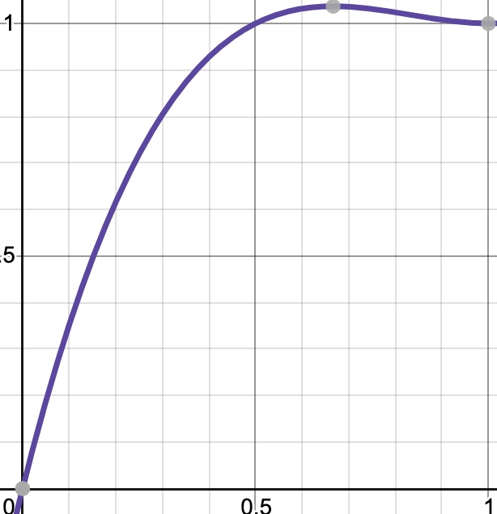
  |
|  AnticipateInterpolator |   |  y= x^2((T + 1)x - T) | 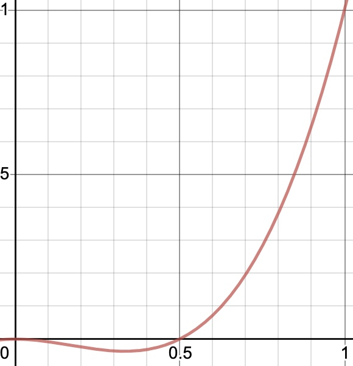
 |
|AnticipateOvershootInterpolator|   | |   |

> MD的表格编辑垃圾的一批，贴图或者公式表格错乱，谁有好的解决方案可以告知下

> 绘图工具:[desmos](https://www.desmos.com/calculator)

注：了解了这些曲线之后，我们知道，所谓插值器，就是将线性变化的动画速率，通过算法，变成一些非线性的数据，从而实现特殊的动画效果。
基本上系统提供的插值器，足够应对日常一些开发需求，但是有的时候遇到一些特殊的动画效果时，还是需要自定义一些插值器。

借鉴上面系统给的示例，我们通过函数组装，来定义一个减速加速插值器

#3自定义插值器：减速加速插值器
根据加速减速插值器的图像，通过工具拟合曲线的公式如下，依然是简单函数在不同区间的图像叠加
```java
import android.animation.TimeInterpolator;
public class DecelerateAccelerateInterpolator implements TimeInterpolator {
    @Override
    public float getInterpolation(float input) {
        float result ;
        if (input < 0.5) {
            result = (float) (Math.sin(Math.PI * input)) / 2;
        }else {
            result = (float)(2 - Math.sin(Math.PI * input)) / 2;
        }
        return result;
    }
}
```
Demo如下:
```
        tvInterpolator.setOnClickListener(new View.OnClickListener() {

            @Override

            public void onClick(View v) {

                float curTranslationX = tvInterpolator.getTranslationX();

                ObjectAnimator animator = ObjectAnimator.ofFloat(tvInterpolator, "translationX", curTranslationX, 800, curTranslationX);

                animator.setDuration(2000);

                animator.setInterpolator(new DecelerateAccelerateInterpolator());

                animator.start();

            }

        });
```
效果如下：
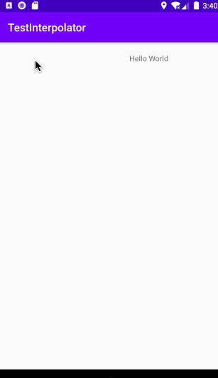

>
插值器决定了速率如何变化，而估值器就决定值如何变化。Interpolator返回的result，将参与TypeEvalueator中数值的计算


#4估值器TypeEvalueator
```    
public interface TypeEvaluator<T> {
   T evaluate(float fraction, T startValue, T endValue);
}
```
* fraction：表示“当前”动画进度
* startValue：表示开始值
* endValue：表示结束值

## 作用：
设置属性值从初始值如何过度到结束值,系统中内置了七种估值器


| 作用  |  对应的Java类 |
|---|---|
|  此求值程序可用于在表示ARGB颜色的整数值之间执行类型插值 |ArgbEvaluator.java |
|  此求值程序可用于在float[]值之间执行类型插值 | FloatArrayEvaluator  |
|  此求值程序可用于在float值之间执行类型插值 | FloatEvaluator  |
|  此求值程序可用于在int[]值之间执行类型插值 | IntArrayEvaluator  |
|  此求值程序可用于在int值之间执行类型插值 | IntEvaluator  |
|  此求值程序可用于在PointF值之间执行类型插值 | PointFEvaluator  |
|  此求值程序可用于在Rect值之间执行类型插值 | RectEvaluator  |


##使用场景：
和插值器相同，系统提供的估值器也能满足大部分的开发需求了。那什么时候会用到自定义的估值器呢，观察系统的估值器，发现没有对Object属性进行操作估值器。因为系统也不清楚，你需要如何对对象的属性进行操作。一般用于我们需要对一个Object的属性进行操作时，会用到。

* 示例：自定义一个估值器，实现抛物线运动

```java
import android.animation.TypeEvaluator;
import android.graphics.PointF;

public class PointFEvaluator implements TypeEvaluator<PointF> {
    @Override
    public PointF evaluate(float fraction, PointF startValue, PointF endValue) {
        PointF pointF = new PointF();
        // x方向匀速移动
        pointF.x = startValue.x + fraction * (endValue.x - startValue.x);
        // y方向加速移动
        pointF.y = startValue.y + fraction * fraction * (endValue.y - startValue.y);
        return pointF;
    }
}
```
对应的Activity代码：

```JAVA
        tvBall = (TextView)findViewById(R.id.tv_ball);
        tvBall.setOnClickListener(new View.OnClickListener() {
            @Override
            public void onClick(View v) {
                Point point = new Point();
                //获取屏幕宽高
                ((WindowManager) getSystemService(getApplicationContext().WINDOW_SERVICE)).getDefaultDisplay().getSize(point);

                ValueAnimator animator = new ValueAnimator().setDuration(1000);
                //定义球运动的终点坐标
                animator.setObjectValues(new PointF(0, 0), new PointF(point.x - tvBall.getWidth(), point.y - tvBall.getHeight()));
                //PointFEvaluator为自定义的估值器，用来封装需要的数据
                animator.setEvaluator(new PointFEvaluator());
                animator.addUpdateListener(new ValueAnimator.AnimatorUpdateListener() {
                    @Override
                    public void onAnimationUpdate(ValueAnimator animation) {
                        PointF point = (PointF) animation.getAnimatedValue();
                        tvBall.setX(point.x);
                        tvBall.setY(point.y);
                    }
                });
                animator.start();
            }
        });
```


效果如图：
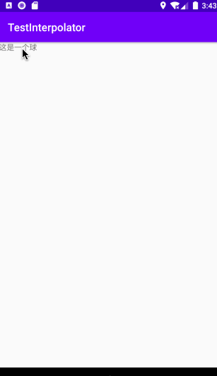


注：现在我们已经学会插值器和估值器的使用方法了，问题来了：刚刚我们说到插值器中的input参数表示动画整体进度，而估值器中的
fraction表示当前动画的进度，是什么意思呢。

# 5.插值器与估值器的关系
  我们自定义一个线性插值器，将input参数输出出来
```java
import android.animation.TimeInterpolator;
import android.util.Log;

public class CustomLinearInterpolator implements TimeInterpolator {
    @Override
    public float getInterpolation(float input) {
        Log.d("lb", "input=" + input);
        return input;
    }
}
```
activity中，将估值器的数据也打印出来
```java
tvText.setOnClickListener(new View.OnClickListener() {
    @Override
    public void onClick(View v) {
        float curTranslationX = tvText.getTranslationX();
        ObjectAnimator animator = ObjectAnimator.ofFloat(tvText, "translationX", curTranslationX, 800);
        animator.setDuration(3000);
        animator.setInterpolator(new CustomLinearInterpolator());
        animator.setEvaluator(new FloatEvaluator() {
            @Override
            public Float evaluate(float fraction, Number startValue, Number endValue) {
                Log.d("lb", "完成比例：" + fraction);
                float startFloat = startValue.floatValue();
                return startFloat + fraction * (endValue.floatValue() - startFloat);
            }
        });
        animator.start();
    }
});

```
运行，看一下打印日志：看起来，input参数和fraction的值是一样的。

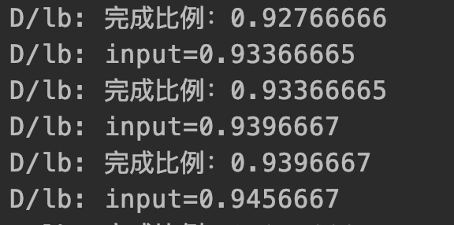
现在的代码是一个起始点，一个结束点。我们修改下代码，将位移数据再增加一个数据，变成两个起始点，两个结束点。运动效果就是textview先从0运动到800，在从800运动到0.
```java
ObjectAnimator animator = ObjectAnimator.ofFloat(tvText, "translationX", curTranslationX, 800, curTranslationX);
```
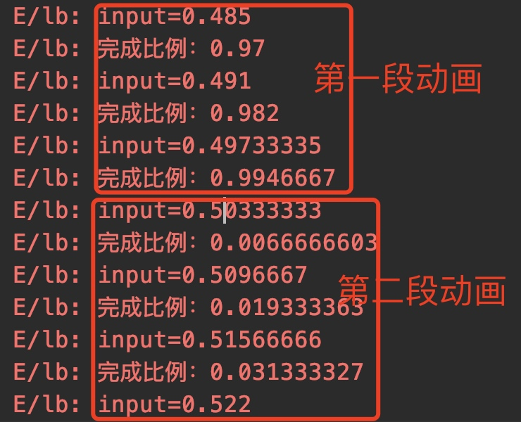

通过日志不难发现：
* 估值器的fraction参数变成了两段，分别从0-1
* 插值器的input值始终只有一段，从0-1

由此我们也就能够理解估值器fraction这个参数的含义：表示动画中某一段动画的播放进度，而插值器的input控制的是整段动画的进度。


